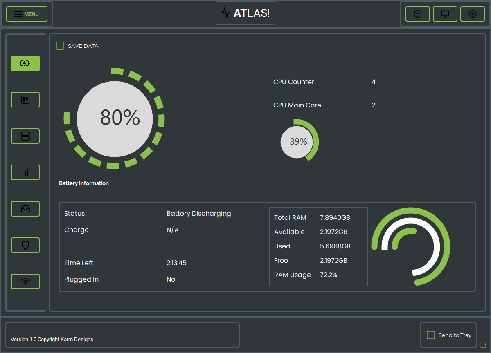
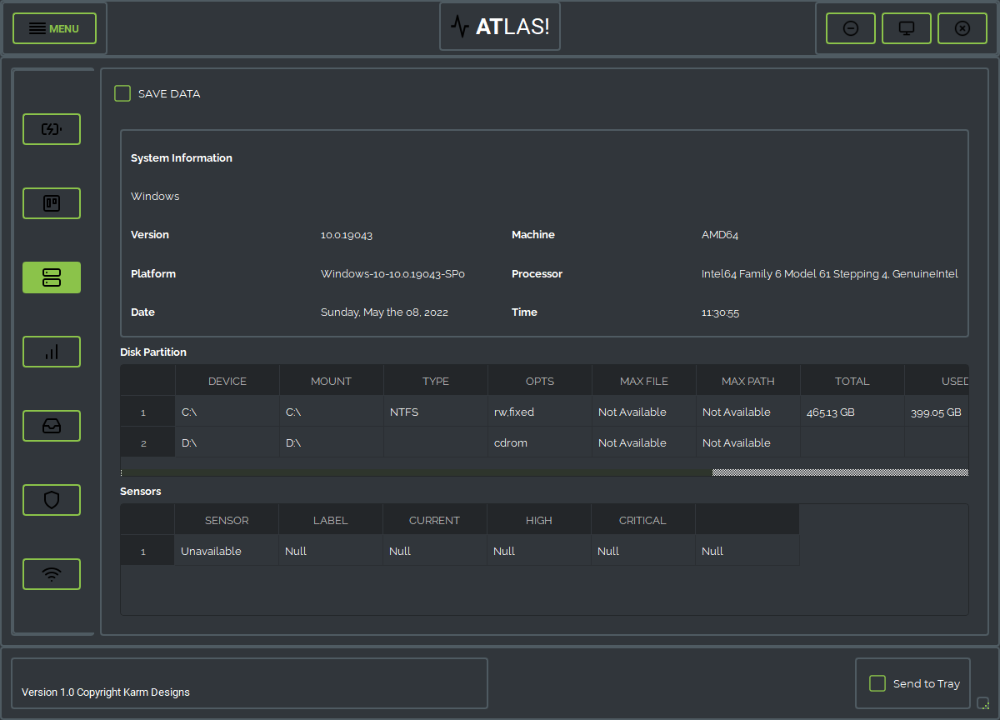
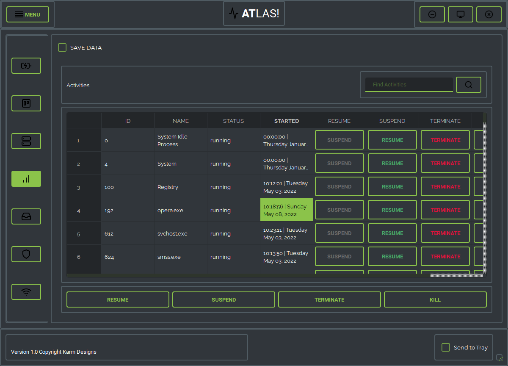

# atlas
An app that can do a lot. Built using Python & PyQT5, atlas is a software that mainly reduces the data consumption of your operating system. It also displays important system information, help manage running and background processes, show battery time (time to fully charge and time left). You can also send to tray, minimize app or enlarge. 

Simply download the zip file and in the terminal 
`pip install -r requirements.txt && python3 app.py`

BATTERY INFORMATION

SYSTEM INFORMATION

TASK MANAGER

